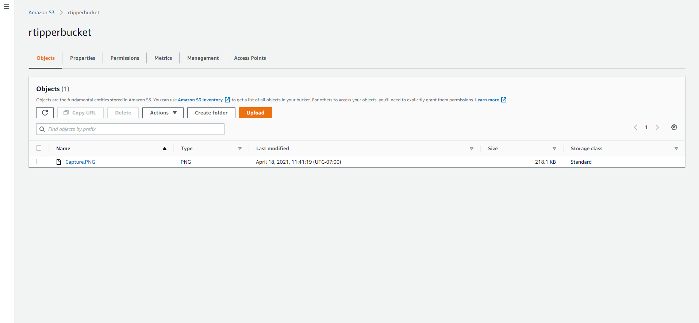
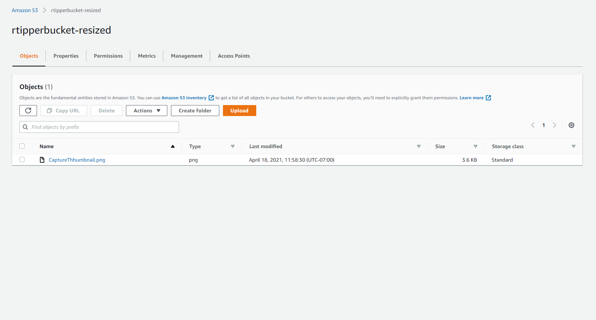

# Lab 17 -- Lambda Image

# FEATURE TASKS
A user should be able to upload an image at any size, and have both the original size and a thumbnail size
When an image is uploaded to your S3 bucket, it should trigger a Lambda function which must;

Create a 50x50 pixel thumbnail version of that image
Save it to another S3 bucket.

It should do so with a predictable naming convention, so that your server and/or frontend know where that thumbnail image will be.

# BUCKETS

# MAIN IMAGE

# THUMBNAIL IMAGE
:(
